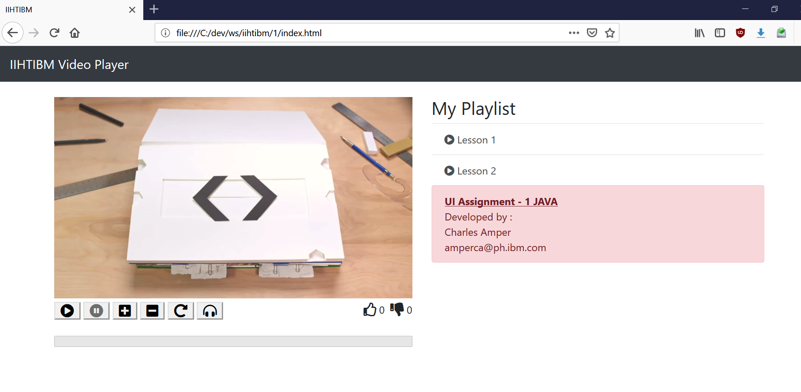
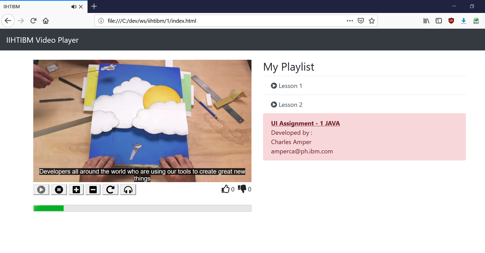

# HTML5 Video Player

This is assignment number 1 for the [IIHT](https://iiht.com/)/IBM Java fullstack training.

## Built With
* HTML5
* Javascript ES5
* Bootstrap 4.xx

## Author
* **Charles Amper**

* **Date submitted** : February 20, 2019
* **Training date** : December 2018 - ongoing

### Installing

```
git clone git@github.com:talbhoggs/iiht-ibm-training1.git

open index.html (with your favorite web browser)

Your done!
```

## Screenshots



